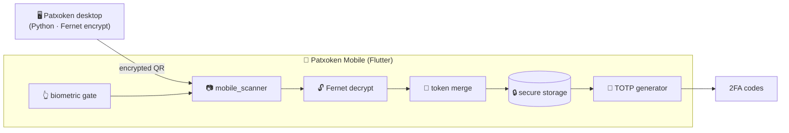

<div align="center">

# 📱 Patxoken Mobile

**Cross-platform companion app** · Flutter (Android / iOS) · 2FA on the go · In production


The mobile companion to the **Patxoken** desktop app. It imports accounts from the desktop by
**scanning an encrypted QR code**, generates **TOTP (2FA)** codes locally, locks behind **biometrics**,
and stores everything **encrypted on-device** — with a cryptography layer that interoperates with the
Python desktop client.

</div>

> **Note on source code.** This repository is a **public showcase** of a commercial product.
> The full source is private; this README documents the architecture and engineering decisions.
> Code walkthrough available on request.

---

## 📸 Screenshots

| Token list | Import via QR | Biometric lock |
|---|---|---|
| _(screenshot)_ | _(screenshot)_ | _(screenshot)_ |

---

## ✨ Features

- 🔑 **TOTP / 2FA on the phone** — time-based codes generated locally, no network needed.
- 📷 **Import by QR** — scan an encrypted payload from the desktop app; no manual re-typing.
- 🧬 **Cross-platform crypto** — Fernet encryption used compatibly between Python (desktop) and Dart (mobile).
- 👆 **Biometric gate** — fingerprint / face unlock required to open the app (`local_auth`).
- 🔒 **Encrypted at rest** — tokens kept in the platform secure storage (`flutter_secure_storage`).
- 🔀 **Smart token merge** — combines existing accounts with imported ones without creating duplicates.
- 📲 **Android & iOS** from a single codebase.

---

## 🏗️ Architecture

The phone never receives credentials in the clear: the desktop encrypts the payload, the phone scans it,
decrypts it with a shared scheme, and persists it in secure storage behind a biometric gate.



**Project layout** (feature-oriented):

```
lib/
├── models/      token_account
├── screens/     login · home · add_token · import_qr · settings
├── services/    otp · secure_storage · token_merge · device_id · uuid
└── widgets/     token_display
```

---

## 🧰 Tech stack

| Concern | Package |
|---|---|
| **Framework** | Flutter · Dart (Android / iOS) |
| **State** | `provider` |
| **2FA** | `otp` (TOTP generation) |
| **QR import** | `mobile_scanner` |
| **Biometrics** | `local_auth` |
| **Secure storage** | `flutter_secure_storage` |
| **Cryptography** | `fernet` (interoperable with the Python desktop) |
| **Misc** | `shared_preferences` · `http` · `uuid` · `package_info_plus` · `url_launcher` |

---

## 🔒 Engineering highlights

- **Cryptography that speaks two languages.** The hardest part was making encryption interoperate between
  the **Python desktop** (which produces the QR payload) and the **Dart mobile app** (which consumes it).
  Using Fernet on both sides, the phone can decrypt exactly what the desktop encrypted — no plaintext ever
  crosses the channel.
- **Defense in depth.** Biometric unlock on launch + secrets encrypted at rest in the OS secure storage,
  so a stolen/unlocked device still doesn't expose the tokens.
- **Idempotent import.** A dedicated merge service reconciles incoming accounts with existing ones, so
  re-importing never duplicates an account.
- **Offline by default.** TOTP generation is fully local — the app works with no connectivity.

---

## 👤 Author

**Carlos Alberto C. de Azevedo Filho** — Software Developer
🌐 [patoxzor.github.io](https://patoxzor.github.io) · 💼 [LinkedIn](https://www.linkedin.com/in/azevedoocarlos/) · 🐙 [GitHub](https://github.com/Patoxzor)
